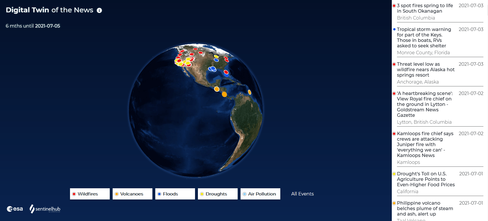
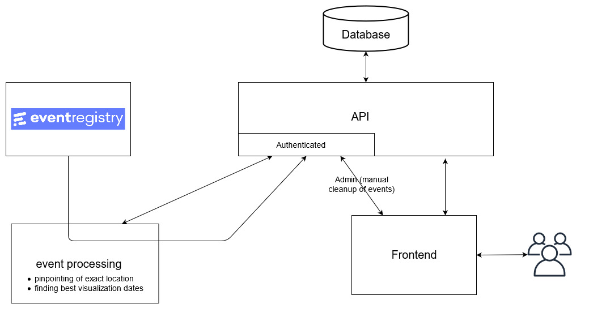

## About

The Digital Twin of the News (DToN) automatically combines Earth Observation (EO) data with news data about extreme natural events (e.g., wildfires). Offering such data within a Digital Twin (in this case, the virtual representation of the Earth) allows quick and easy access to information whose retrieval meant at least several hours of work just a few years ago. In light of climate change, extreme natural events will most likely occur more frequently in the next years, reinforcing the need for a fast and automated way to event-related information from various sources.

 

## Development

See ReadMe of single components (dton-fe, dton-event-processing, dton-api) for details.

## DToN architecture

  